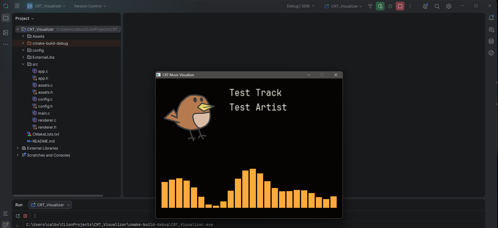
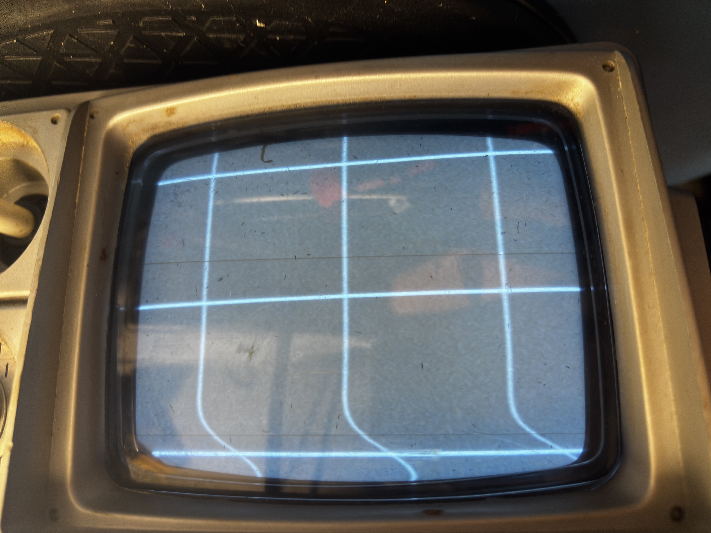
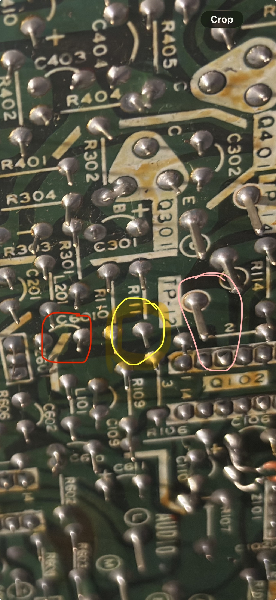

# VisAmp
A cross-platform C/SDL music display system featuring a lightweight Linux runtime for embedded computers and a more feature-rich Windows previewer for customizing layouts, album art, metadata, animations, and real-time visualizers before deployment to an analog CRT through direct composite video injection. The unit also houses a combined 500W bass/guitar amplifier and a 150W HiFi stereo amplifier.

The system is designed to bypass the television's RF input chain entirely, allowing a Raspberry Pi or similar computer to provide a cleaner baseband NTSC video signal directly to the CRT's video circuitry.

# Current Status
- Programming work is paused until the Daytron DT-505A is fully operational.
- The CRT currently suffers from minor vertical fold-over and requires a recap.
- A composite video injection point has been identified on the DT-505A for use with the Raspberry Pi's analog video output.
- Amp design is in the architecture phase — power stage topology and instrument switching are decided; specific preamp chips are not yet chosen.

  
Very quick initial test of SDL libraries to make sure everything works (Final version will contain substantially nicer visuals)

# DT-505A Restoration
A vertical foldover issue is most likely caused by old, failing electrolytic capacitors in the vertical section of the circuit board. The initial foldover problem was diagnosed using a Heathkit test image generator in B&W mode, injected through the original RF input. The image below shows the top of the foldover problem where the curving of the image is present.

# Composite Injection Overview
The simplest way to display video from a Raspberry Pi on an older television is to pass its composite output through an RF modulator and feed the resulting signal into the TV's antenna input. While convenient, this method introduces several unnecessary stages into the signal path, including RF modulation, the television's tuner and IF circuitry, and subsequent video demodulation. Each additional stage provides another opportunity for interference, noise, and signal degradation.

This is especially noticeable on the Daytron DT-505A, where there is very little RF shielding between the mains transformer and portions of the television's signal-processing circuitry.

A cleaner approach is to inject the Raspberry Pi's composite video signal directly into the television's baseband video path.

After the television's tuner and IF stages recover the incoming broadcast signal, the downstream video circuitry ultimately operates on a baseband NTSC composite signal containing the luminance, synchronization, blanking, and, where applicable, chrominance information required to produce an image. Because the Raspberry Pi can generate a compatible composite NTSC signal directly, its output can be inserted after the RF decoding stages rather than being converted to RF and then demodulated again by the television.

On the Daytron DT-505A, the composite injection point was identified immediately after the video-output pin of the uPC1366C video processor. A through-hole AC-coupling capacitor sits in series with the video path at this location (Red Circle), providing a convenient point to isolate the original signal and connect the Raspberry Pi's composite output to the downstream video circuitry. A video output test point (Pink Circle) also provides an easy diagnostic point next to two parallel resistors (Yellow Circle).

The original RF video path can either be permanently disconnected at this point or retained through the addition of a selector switch, allowing the television to alternate between its original RF input and the externally generated composite signal.

# Integrated Bass/Guitar Amplifier + HiFi Stereo Amplifier
Alongside the visualizer, this project includes a DIY class D instrument amplifier for bass and guitar, designed to match or exceed the quality of a ~$1000 commercial amp at a fraction of the parts cost. There will also be a smaller 150W stereo amp meant for listening to audio through normal speakers, not for musical instruments.

Design overview:
- Single shared power stage: a discrete class D design built around an IRS20957S-family driver IC plus external power MOSFETs, rather than an integrated class D chip. This was chosen over simpler integrated options (e.g. TPA3255) specifically to hit a 500W target for bass.
- One mono 500W power stage (not dual-channel), since bass and guitar are never used simultaneously — a hardware switch/interlock selects one instrument and its speaker output at a time, avoiding the cost, complexity, and shared-rail crosstalk of running two full-power channels.
- Two fully separate preamp paths (bass and guitar), selected by the same switch, so each instrument's tone shaping can be tuned independently.
- Design philosophy: keep the power amp stage clean and transparent, and let all tone character come from the preamps and pedals rather than the power stage itself.

